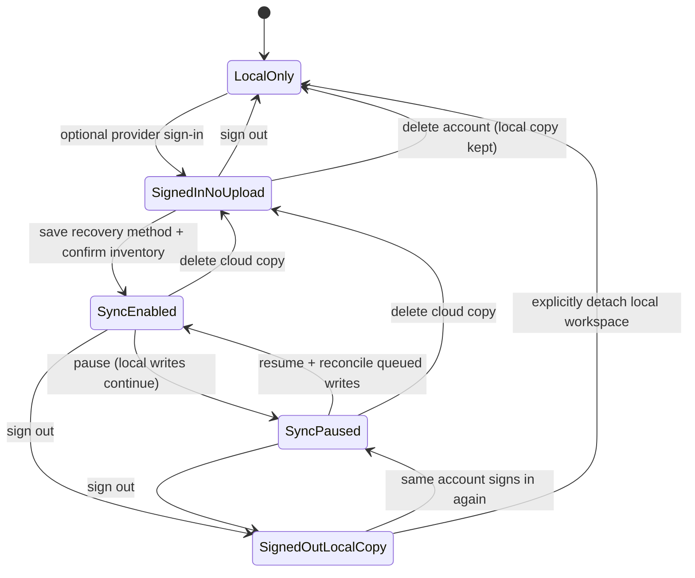
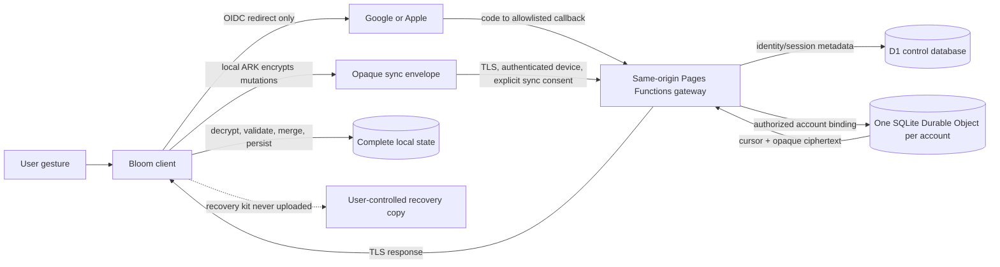

# Bloom optional sync contract

**Status:** binding architecture decision for PLAN 11.1, reviewed 2026-08-12. Runtime auth and
sync code may not precede this contract. Any implementation difference that changes privacy,
security, retention, account behavior, encryption, or the synchronized data inventory requires a
new numbered PLAN step or an explicit amendment and review here first.

## Product boundary

Bloom remains complete without an account. Local-only is the default and makes no application-data
request after the app shell loads. Signing in and enabling sync are separate choices:

1. **Sign in** sends only the identity/authentication data needed to create or resume a Bloom
   account. It does not upload Bloom state.
2. **Enable sync** shows the exact inventory below, creates an end-to-end encryption key on the
   device, requires a saved recovery method, and asks for a separate confirmation before the first
   Bloom payload leaves the device.
3. **Pause, sign out, delete the cloud copy, delete the account, and delete local data** are distinct
   actions. Pausing or signing out keeps the complete local copy.

Sync is a data-stewardship feature, not a timer dependency or a behavior-change mechanism. The
timer, tasks, goals, Guide, insights, export/import, and every other core path continue to work
offline. Remote state is never the only copy. Diagnostic or performance reporting is not authorized
by sync consent and is outside this contract.

### State model



- `LocalOnly` has no account or sync traffic.
- `SignedInNoUpload` may refresh an authentication session, but no `bloom-state`, Companion event,
  backup, key, or content-derived value is sent.
- `SyncEnabled` uploads only encrypted envelopes after explicit consent and keeps a durable local
  outbox until the server acknowledges each mutation.
- `SyncPaused` and `SignedOutLocalCopy` make no background sync request. Mutations remain local and
  visibly queued. A user-initiated sign-in/sign-out request is the only permitted network activity.
- Deleting the cloud copy disables sync and advances a cloud generation so a stale device cannot
  re-create the deleted copy. Re-enabling requires the first-upload confirmation again.

## Architecture decision

### Selected provider and hosting

Keep the existing static app on Cloudflare Pages at `https://bloom-pomodoro.pages.dev`. A
same-origin Pages Functions gateway owns only `/api/sync/v1/*`. It binds to:

- a small Cloudflare D1 database containing accounts, identity aliases, sessions, device grants,
  deletion generations, and audit-safe security metadata; and
- a separate Worker exporting one SQLite-backed Durable Object per random Bloom account id. The
  Durable Object stores that account's opaque encrypted mutation stream, snapshots, cursors,
  acknowledgements, and quota counters.

Cloudflare requires a Durable Object to be created in a separate Worker and then bound to a Pages
project; it cannot be deployed from the Pages project itself. The deployment order for PLAN 11.3 is
therefore D1 migration, Durable Object Worker, then Pages Functions/static Pages. Staging and
production use different D1 databases, Durable Object namespaces, OIDC clients, secrets, and cookie
names. No production binding or secret is added in PLAN 11.1.

This choice keeps the browser API same-origin, gives each account serialized mutation ordering and
private transactional storage, and limits a storage fault to one account's content object. D1's
unique constraints make provider linking and session/device authorization atomic. Cloudflare
encrypts D1 and Durable Object storage at rest and uses TLS inside its network; this is defense in
depth, not a substitute for Bloom's end-to-end encryption.

Authoritative platform references:

- [Pages Functions bindings](https://developers.cloudflare.com/pages/functions/bindings/)
- [Durable Objects and SQLite storage](https://developers.cloudflare.com/durable-objects/api/sqlite-storage-api/)
- [Durable Object data security](https://developers.cloudflare.com/durable-objects/reference/data-security/)
- [D1 data security](https://developers.cloudflare.com/d1/reference/data-security/)
- [D1 Time Travel and backups](https://developers.cloudflare.com/d1/reference/time-travel/)

### Account identity

The first release supports Google OpenID Connect and Sign in with Apple. Supporting Apple as well as
Google keeps account choice available across the web, Android, and iOS release surfaces.

- Use the authorization-code server flow with `state` and `nonce`; Google native/public-client
  authorization also uses PKCE. Apple's server flow uses its documented signed client secret and
  must not be given an undocumented PKCE parameter. Do not use an implicit flow, provider JavaScript
  SDK, remote script, or embedded webview.
- Request only base OpenID identity. Do not request contacts, profile, calendar, behavioral, or
  cloud-drive scopes. Do not persist a provider name or email even if it appears in an identity
  token.
- Account lookup uses the OIDC pair `(issuer, sub)`. D1 stores
  `HMAC-SHA-256(server identity-pepper, issuer || 0x00 || sub)` under a unique constraint, never the
  raw `sub`, email, or display name. A Bloom account id is a separate random 128-bit value.
- Linking a second provider is allowed only from a recently re-authenticated Bloom session. The D1
  transaction must prove that the new provider alias is not linked elsewhere.
- Web sessions use `Secure`, `HttpOnly`, host-only, `SameSite=Lax` cookies, CSRF tokens on mutations,
  short access lifetime, rotation on privilege change, and server-side revocation. Native sign-in
  uses `ASWebAuthenticationSession` or a system browser/custom tab; the HTTPS callback exchanges a
  device-challenge-bound, single-use bearer handoff (60-second maximum) for an opaque native
  session. It is never reused as a session credential, and query strings are stripped from logs.
- Native session credentials live only in iOS Keychain or Android Keystore-backed secure storage.
  Credentials, session tokens, device grants, and encryption keys never enter `localStorage`.

The provider protocol sources are [Google OpenID Connect](https://developers.google.com/identity/openid-connect/openid-connect),
[Sign in with Apple for the web](https://developer.apple.com/documentation/signinwithapple/configuring-your-webpage-for-sign-in-with-apple),
and [Apple's Sign in with Apple REST API](https://developer.apple.com/documentation/signinwithapplerestapi).

## Exact endpoint allowlist

The application must reject any runtime application-data URL outside this table. The service worker
must continue to treat `/api/` and `/auth/` as network-only and must never cache an authenticated
response. All responses use `Cache-Control: no-store`.

### App-to-Bloom API (same origin only)

| Method and exact path | Allowed state | Purpose and permitted cleartext |
| --- | --- | --- |
| `GET /api/sync/v1/auth/google/start` | user gesture | Create state/nonce/PKCE transaction and redirect; no Bloom content. |
| `GET /api/sync/v1/auth/apple/start` | user gesture | Create state/nonce/PKCE transaction and redirect; no Bloom content. |
| `GET /api/sync/v1/auth/google/callback` | provider redirect | Validate code, issuer, audience, nonce, and state; establish a session. |
| `POST /api/sync/v1/auth/google/handoff` | native user gesture | Exchange one single-use native handoff. |
| `GET /api/sync/v1/auth/apple/callback` | provider redirect | Validate code, issuer, audience, nonce, and state; establish a session. |
| `POST /api/sync/v1/auth/apple/handoff` | native user gesture | Exchange one single-use native handoff. |
| `POST /api/sync/v1/session/refresh` | signed in | Rotate an existing session; no Bloom content. |
| `DELETE /api/sync/v1/session` | signed in | Revoke this session (sign out). |
| `GET /api/sync/v1/account` | signed in | Return account id/fingerprint, sync state, quota, and cloud generation. |
| `POST /api/sync/v1/account/link/google` | recent re-auth | Begin an explicit Google identity link. |
| `POST /api/sync/v1/account/link/apple` | recent re-auth | Begin an explicit Apple identity link. |
| `DELETE /api/sync/v1/account` | recent re-auth + confirmation | Revoke sessions and delete account/cloud data; local data remains. |
| `GET /api/sync/v1/devices` | sync consent exists | List authorized device ids, generic platform, last-seen time, and revocation state. |
| `POST /api/sync/v1/devices` | first enable/resume | Register a random device id and public metadata after sync consent. |
| `DELETE /api/sync/v1/devices/:deviceId` | recent re-auth + confirmation | Revoke one device; it cannot read or write more ciphertext. |
| `GET /api/sync/v1/changes?after=:cursor` | sync enabled/manual refresh | Pull opaque envelopes after a server cursor. |
| `POST /api/sync/v1/changes` | sync enabled/manual refresh | Append an idempotent batch of opaque encrypted mutations. |
| `GET /api/sync/v1/snapshots/latest` | sync enabled/manual refresh | Fetch the latest opaque encrypted snapshot and its covered cursor. |
| `POST /api/sync/v1/snapshots` | sync enabled/manual refresh | Store a client-created encrypted snapshot after compaction checks. |
| `GET /api/sync/v1/export` | explicit user action | Download the account's encrypted cloud envelopes and metadata. |
| `DELETE /api/sync/v1/cloud-copy` | recent re-auth + confirmation | Delete encrypted content, revoke devices, and advance cloud generation. |

Path parameters are strict base64url identifiers with fixed decoded sizes; unknown paths, methods,
content types, origins, and redirects fail closed. A native callback may open Bloom's registered app
link only after the HTTPS callback has validated the provider response.

### Provider redirects and server egress

These are the only non-Bloom hosts authorized by account sign-in. They are never app-shell assets:

- Browser/system-auth redirects: `https://accounts.google.com/o/oauth2/v2/auth` and
  `https://appleid.apple.com/auth/authorize`.
- Server-only token/JWKS requests: `https://oauth2.googleapis.com/token`,
  `https://www.googleapis.com/oauth2/v3/certs`, `https://appleid.apple.com/auth/token`, and
  `https://appleid.apple.com/auth/keys`.

No Google or Apple JavaScript is loaded. No analytics, crash reporter, remote font, CDN asset,
general-purpose proxy, webhook, or diagnostic endpoint is allowlisted. Redirect destinations are
fixed server-side; user input cannot choose a host.

## End-to-end encryption and recovery

### Key and envelope design

The service stores focus content only as opaque ciphertext.

- On first sync enable, the client creates a random 256-bit account root key (ARK) with a system
  cryptographic RNG. The ARK is not derived from the provider identity, user name, device id, or a
  human password and is never uploaded.
- Each mutation or snapshot gets a unique subkey via HKDF-SHA-256 from the ARK and a versioned
  context containing its mutation/snapshot id. Content is encrypted with AES-256-GCM and a fresh
  random 96-bit nonce. Key and nonce reuse is forbidden and tested.
- Canonical associated data authenticates `protocolVersion`, `accountId`, `deviceId`,
  `mutationId`/`snapshotId`, `baseCursor`, `cloudGeneration`, `contentSchemaVersion`, `keyVersion`,
  and the ciphertext byte length. Entity type, entity id, field names, operation, timestamps, and
  values remain inside the ciphertext.
- Server responses add a monotonic account `revision`, an opaque cursor, and server acceptance time.
  These values order valid mutations; device clocks never decide a conflict. Clients remember the
  highest accepted cursor and reject cursor rollback or a different cloud generation.
- Decryption/authentication failure, unknown algorithms, oversized plaintext, invalid schemas, or
  invalid references quarantine only the affected envelope. They never overwrite local data or
  trigger an automatic re-upload of a possibly stale snapshot.

Protocol v1 request mutation shape (base64url values abbreviated):

```json
{
  "protocol": "bloom-sync",
  "protocolVersion": 1,
  "accountId": "random-account-id",
  "deviceId": "random-device-id",
  "mutationId": "collision-safe-id",
  "baseCursor": "opaque-server-cursor",
  "cloudGeneration": 1,
  "contentSchemaVersion": 34,
  "keyVersion": 1,
  "algorithm": "A256GCM+HKDF-SHA256",
  "nonce": "...",
  "ciphertext": "..."
}
```

The encrypted plaintext is a versioned mutation containing entity kind/id, operation, changed
fields, references, and explicit base field/entity revisions. The accepted response echoes the
mutation id and adds the server revision/cursor. The Durable Object serializes acceptance and
deduplicates `(accountId, deviceId, mutationId)`.

Cloudflare's TLS and storage encryption protect transport and disks. End-to-end encryption adds the
stronger promise that Bloom's service operators and a database reader cannot read focus content.
It does **not** protect content on an unlocked device, content the user exports as a plaintext local
backup, metadata listed below, or content from malicious app code/XSS running at the trusted Bloom
origin.

### Recovery and second devices

Before first upload, Bloom displays a versioned recovery kit containing the account fingerprint,
ARK, key version, and checksum as printable/downloadable text plus QR. It is generated locally. The
user must confirm that it was saved or pair another unlocked device before upload becomes available.
The recovery kit contains the key, not a copy of Bloom data, and is distinct from the plaintext 9.4
JSON backup.

A second device first signs into the same OIDC-backed Bloom account, then scans/imports the recovery
kit or accepts a local encrypted transfer from an already unlocked device. Only after the account
fingerprint matches may it download and decrypt a snapshot. Provider sign-in alone cannot decrypt
content.

On the web, a non-extractable device wrapping key lives in IndexedDB and wraps the ARK; the wrapped
ARK and sync queue also live outside `localStorage`. Native builds store the ARK in Keychain or
Keystore-backed secure storage. Re-export requires an unlocked device and recent re-authentication.

There is no server escrow, provider-derived recovery, support backdoor, or reset that can decrypt an
existing cloud copy. If every ARK/recovery copy is gone, the ciphertext is unrecoverable. The honest
recovery is to keep/export any still-readable local copy, delete the unreadable cloud copy, create a
new ARK, and explicitly start a new cloud generation. Device revocation denies future remote access
but cannot erase data or keys already present on a missing device. Optional key rotation after
revocation creates a new ARK and recovery kit and requires remaining devices to re-pair.

## What the service can and cannot read

### The service can read

- random account id; HMAC'd provider alias; provider kind; account/session creation, expiry,
  revocation, deletion, and cloud-generation metadata;
- random device id, generic platform (`web`, `ios`, `android`), protocol version, last-seen time,
  last acknowledged cursor, key version number, and revocation state;
- mutation/snapshot ids, base and accepted cursors/revisions, acceptance times, ciphertext byte
  lengths/counts, request outcome, quota usage, and whether a row is a mutation or snapshot;
- source IP, coarse user agent, request path, latency, status code, and rate-limit/security outcome
  for the short operational-log window below; and
- aggregate service health that cannot be joined back to an account after its short-lived request id
  expires.

This metadata can reveal that an account exists, when it syncs, approximate payload volume, device
count/platform, and mutation frequency. The consent screen must say so; E2EE must not be described as
metadata anonymity.

### The service cannot read

- user name, task or parking text, goal titles/units/dates, ritual text, foundation names, daily
  plans, Guide reading details, settings values, Companion answers, session timing/outcomes/targets,
  history totals, streaks, XP, or any other Bloom-state value;
- entity kind/id, field name, operation, tombstone target, relationship, record timestamp, or
  plaintext schema body inside a mutation;
- ARKs, derived encryption keys, recovery kits, local plaintext backups, local outboxes, corrupt
  plaintext diagnostics, timer return snapshots, or live/paused timer state; or
- decrypted cloud export content. `/export` returns the same opaque envelopes the service stores.

Support and operations tooling may inspect account/control metadata only through audited,
least-privilege paths. There is no content-search endpoint and logs never include request/response
bodies, authorization headers, cookies, OIDC codes/tokens, query strings, ciphertext, nonces, or
recovery material.

## Synchronized and device-local fields

The current local schema is `SCHEMA_VERSION = 34`. PLAN 11.2's v33→v34 pass-through migration
marks the first sync-protocol baseline without rewriting any user id or timestamp. Later steps must
update this table if the shape changes before implementation. “Sync” below means the value is
represented in encrypted mutations, not that the service can inspect it.

| Persisted field/slice | First-release policy and conflict rule |
| --- | --- |
| `version` | Not a user entity. Carried as `contentSchemaVersion`; older content migrates through the same append-only `MIGRATIONS` chain as localStorage/import. |
| `sessions` | Sync. Imported once as a bootstrap counter component; later completions are idempotent signed increments keyed by mutation id so concurrent devices do not lose a count. |
| `streak`, `lastFocusDay`, `restDayUsedOn`, `comeBack` | Sync as a day-summary cache. Recompute from merged records when possible; otherwise the later valid study-day value wins, with server revision breaking equal-day conflicts. Never use device timestamp ordering. |
| `tasks` | Sync each task by stable id. Text/goal/done/completion fields use field-level server revisions; pomodoro credit is an idempotent counter delta. A delete creates a tombstone. |
| `activeTaskId` | Device-local. It is a current-device selection and can affect the next local session; another device may not take it over. Invalid local references still sanitize to `null`. |
| `palXp` | Sync as per-pal idempotent increment components. Materialized XP is their sum, bounded by existing sanitizers. |
| `goals` | Sync by stable id with field-level server revisions and tombstones. `done` is never independently merged: it is re-derived from the merged `goalLedger`; completion time follows the first derived threshold crossing retained by the ledger history. |
| `goalLedger` | Sync append-only signed-delta rows by stable id. Identical replay is idempotent; a divergent same-id row is quarantined. Corrections are new signed rows, and goal deletion preserves ledger history inside the encrypted backup/snapshot even when hidden in UI. |
| `foundations.instances` | Sync by stable id. Scalar fields use field revisions; active ranges are explicit range mutations; removal uses a tombstone and may not delete history. |
| `foundations.entries` | Sync by natural key `instanceId:dayKey`. Upsert/remove conflicts use server revisions; `recordedAt` remains display/provenance data, never the ordering clock. |
| `foundations.archive` | Sync by `instanceId:monthKey` with compaction provenance. A later snapshot may replace only the exact covered source mutations; compacted months cannot be resurrected by an old entry. |
| `dayPlan.targets` | Sync by target id. Fields use server revisions, actuals remain derived from ledger/session sources, and deletion creates a tombstone. Frozen snapshots remain unchanged unless the target itself is explicitly edited under existing rules. |
| `dayPlan.archive` | Sync by `weekKey` with covered-source provenance; divergent aggregates are not added blindly. Recompute from available source mutations or quarantine for review. |
| `lastRolloverOfferDay` | Sync as a prompt-cap marker. The greatest valid study-day key wins; server revision breaks an equal-day conflict. |
| `flow` | Device-local in full (`startedAt`, `acc`, `running`). A paused/running stopwatch never transfers implicitly. A finalized Flow result enters `sessionRecords` and then syncs. |
| `sessionRecords` | Sync finalized records append-only by collision-safe id. Identical replay is idempotent. Repairs are explicit mutations referencing a base entity revision; allowed fields use later server revision. Divergent creates with one id are quarantined, not overwritten. Deletes retain tombstones. |
| `historyArchive.hours` | Sync encrypted aggregates with natural bucket ids plus exact source-mutation compaction provenance. The service accepts a compaction only once per covered source set; clients never sum two aggregates whose provenance overlaps. |
| `historyArchive.completedTasks` | Sync by archive-row id with the same source coverage rule. |
| `historyArchive.overflow` | Sync only as a provenance-bearing compaction component. Components union by unique compaction id; bare totals never use max, addition, or last-write-wins. |
| `openFocus`, `openFlow` | Device-local. They are live/paused session ownership and are swept/finalized only by their originating device. Another device cannot finish, abandon, repair, or delete them. |
| `lastWeeklyReviewWeek` | Sync as a prompt-cap marker; greatest valid week key wins so two devices do not repeatedly surface the same review. |
| `ifThenPlans` | Sync by stable id with field revisions and tombstones. Usage is an idempotent counter delta; `lastUsedAt` is payload/provenance, while conflict order comes from server revision. |
| `ritual` | Sync enabled/suggestion flags field-by-field; items are entities by item id with field revisions and tombstones. Transient checked state remains device-local because it is not persisted. |
| `lastWoopOfferAt` | Sync the accepted offer marker. Concurrent values use server revision, not the larger device timestamp; the timestamp is range-validated provenance for the cooldown. |
| `preSlump` | Sync as per-study-day prompt-emission ids plus a field-revisioned silence choice; materialize `count` and `lastSessionId` from that set. Existing scalar state becomes one bootstrap component. |
| `personalCadence` | Sync user-applied cadence history as idempotent mutations. `recommendation`/`computedAt` are caches and are recomputed from merged records; concurrent cache values never overwrite source data. |
| `parking` | Only revealed/finalized thoughts sync by stable id with field revisions and tombstones. A thought with `revealedAt: null` belongs to an unresolved local session and stays device-local until its natural pause. |
| `guideRead.readAt` | Sync per bundled article id using server revision; the timestamp is provenance, not the conflict clock. Unknown article ids remain invalid. |
| `guideRead.suggestions` | Sync by `momentKey`; identical replay deduplicates and later explicit revision supersedes. Cap after deterministic sort without deleting unacknowledged source mutations. |
| `settings` | Sync every persisted user choice (`name`, durations, sound, auto-start, appearance, pal, Companion choices, flow/planner/foundations toggles, goal-credit choice, chronotype, pre-slump choice, and day-start hour) with independent field revisions. OS notification authorization, secure-key handles, and platform permissions are not settings and remain device-local. |
| `bloom-companion-v1` events | Sync the separate Companion log append-only by event id. PLAN 11.2 assigns deterministic migration ids to legacy id-less events without changing their payload. Repairs reference a base revision; divergent same-id content quarantines; deletion uses a tombstone. |

Additional device-local state includes `today`, `now`, `mode`, `running`, `endsAt`, `remaining`,
`justDone`, `armedGoalId`, `flowStart`, unresolved return/debrief/dialog state, onboarding/UI focus,
notification authorization, auth/session credentials, account consent, device id, cloud generation,
ARK/key handles, inbox/outbox/cursor state, and corruption diagnostics.

### General conflict invariants

1. The Durable Object assigns a strictly increasing per-account revision. Arrival order at that
   object, not a device timestamp, is the tie-breaker for mutable fields.
2. Append-only rows union by stable id. Identical duplicates are idempotent; divergent same-id
   creates are preserved in a conflict quarantine until the user resolves them. Legacy numeric
   task/goal id collisions never silently re-key without updating every encrypted reference.
3. A tombstone at revision `R` defeats any later-arriving edit whose encrypted `baseRevision < R`.
   Re-creation requires an explicit user action naming `R`; stale offline edits cannot resurrect it.
4. References apply only after their target exists and is not tombstoned. Otherwise the mutation is
   retained in a bounded pending/quarantine set; it cannot orphan valid state.
5. Existing 9.4 import rules remain the account-free backup baseline. Sync-specific revision,
   tombstone, counter, and compaction metadata lives in a separate device-local sync store until
   PLAN 11.2 deliberately versions any main-state shape.
6. Clients never emit a snapshot while they have an unknown newer schema, quarantined envelope,
   cursor gap, or unresolved collision.

### Network-free merge baseline (PLAN 11.2)

The first implementation layer is intentionally transport-free. `src/sync/protocol.ts` validates
bounded decrypted mutation envelopes and retains unknown wire fields; `src/sync/merge.ts` applies
server revisions, per-field revisions, tombstones, repair-only append logs, counters, archive
components, reference blocking, and deterministic conflict quarantine. `src/sync/bloomAdapter.ts`
seeds and materializes through the complete validated 9.4 backup envelope while leaving active and
paused timer ownership local. `src/sync/deviceStore.ts` defines an abstract device-store record for
installation/account ids, cursors, outbox rows, and opaque future inbox rows. It is not a
`localStorage` adapter: the web runtime must back it with IndexedDB and native runtime wiring must
follow the platform-storage rules above. Root keys, recovery material, credentials, and tokens are
never fields in that record.

This layer imports no auth or service adapter and contains no runtime request primitive. PLAN 11.3
owns encryption and the authorized service boundary; PLAN 11.5 owns durable runtime queue wiring.

### Optional service implementation (PLAN 11.3)

The account service now lives outside the local app graph in `services/sync/`, with a Pages
Functions gateway in `functions/api/sync/v1/[[path]].ts`, D1 control-plane storage, and a separately
deployed SQLite Durable Object. `SyncServiceClient` is constructor-injected and has no default
transport or singleton; no file under `src/` imports it. Creating an account therefore still cannot
create a device grant or send Bloom content. The first device grant requires the explicit
`consentConfirmed: true` request owned by PLAN 11.4's future reviewed consent screen.

Web access and refresh credentials are host-only Secure HttpOnly cookies with SameSite=Lax; a
separate CSRF token is required for state changes. Native access and refresh credentials are opaque
bearers returned only after a challenge-bound, single-use handoff; platform secure-storage wiring is
still owned by PLAN 11.4 and no credential storage adapter exists in the app. Every content request
resolves the account from the authenticated session, requires an active device grant, and then
selects the Durable Object server-side. Request logs use only route templates and random
account/device/request ids; they omit URL queries, headers, cookies, bodies, ciphertext, nonces, and
keys.

The checked-in Cloudflare configuration is deliberately non-production. Resource ids and all OIDC,
pepper, and internal-service secrets remain outside source control. Provisioning, staging, rotation,
deletion, and rollback instructions are in
[`docs/sync-deployment.md`](sync-deployment.md). Production auth/sync must remain disabled until the
remaining PLAN 11.4-11.6 consent, client, secure-storage, privacy, independent crypto review, and
release-QA gates pass.

## Schema compatibility, snapshots, and long-offline devices

- The outer protocol has an independent `protocolVersion`. Unsupported outer protocols receive
  `426` with no mutation accepted. A minimum supported client version can block sync, never local use.
- `contentSchemaVersion <= current` runs through the same validators and forward migrations as
  localStorage/9.4 import. Unknown fields in a supported envelope survive decrypt/re-encrypt even if
  the current UI does not use them.
- A client encountering newer content stops before that cursor, stores the opaque envelope, shows
  “Update Bloom to finish syncing” in the future sync UI, and continues operating on its local copy.
  It may not upload stale mutations or a snapshot past the gap.
- A snapshot is encrypted client-side and records its covered server cursor/mutation ids outside the
  ciphertext only as opaque ids. The service cannot inspect the state. It may prune covered mutation
  rows only after every active device has acknowledged the snapshot and the 180-day deletion window
  has passed. At least two valid snapshots are retained until the newer one passes verification.
- A device that has not acknowledged sync for 180 days becomes stale. On return it must download a
  current snapshot before pushing. Its unpushed local changes are preserved in a reviewable local
  quarantine/export; they are not blindly applied. This is how pruned tombstones cannot resurrect.

## Quotas, retention, backups, and deletion

### Enforced limits

- 25 MiB of encrypted content per account, including current snapshots and retained mutations;
- 512 KiB maximum encrypted mutation, 5 MiB maximum request batch, and 500 mutations per batch;
- one current device plus up to nine additional authorized devices;
- 120 accepted mutation batches per account per minute, 60 pull/status requests per device per
  minute, and 10 auth starts per IP per ten minutes, with bounded backoff responses; and
- existing local caps and sanitizers still apply after decryption. Cloud quota exhaustion pauses
  upload, keeps local work/outbox intact, and offers encrypted cloud export or cloud deletion.

### Retention

- Active encrypted account content remains until cloud-copy or account deletion.
- Every mutation, including encrypted tombstones, remains at least 180 days and until all non-stale,
  non-revoked devices acknowledge a safe snapshot. Revoked devices do not block compaction.
- Superseded client snapshots remain 30 days after a newer verified snapshot, with at least two
  valid snapshots retained when quota permits.
- Operational request logs retain seven days. Account security events (sign-in, provider link,
  device grant/revoke, cloud/account deletion) retain 30 days. They use random request/account/device
  ids and contain no provider subject, email, content, query string, token, key, ciphertext, or body.
  Aggregate health counters lose joinable ids after seven days.

### Backups and deletion truth

Cloudflare's SQLite-backed Durable Objects support point-in-time recovery for up to 30 days, and D1
Time Travel is 30 days on the selected paid production plan. Those provider-managed histories contain
encrypted payloads and control metadata only. Bloom does not copy them into R2 or a longer-lived
analytics warehouse.

`DELETE /cloud-copy` atomically disables sync, revokes devices, advances `cloudGeneration`, and
clears the account Durable Object's active mutation/snapshot storage. The account and provider link
remain so the user can sign in without re-uploading. `DELETE /account` first revokes all sessions,
then deletes provider aliases, device grants, account/control rows, and the Durable Object contents.
Product APIs must return deletion immediately and must never restore Time Travel/PITR data into a
deleted generation. Cloudflare documents product restore points for at most 30 days, after which
they are no longer restorable through Time Travel/PITR. Cloudflare's general privacy policy allows
otherwise inaccessible copies to be protected from further use when technical deletion is not yet
possible, so Bloom must not claim a physical-erasure deadline that Cloudflare does not contractually
provide. The pre-launch privacy notice must distinguish immediate active/product deletion, the
30-day restore-point window, and any narrower contractual infrastructure-retention statement that
PLAN 11.3 verifies before collecting production data.

A local plaintext JSON backup remains the user's account-free recovery path. Cloud export is an
encrypted protocol archive; an unlocked client may optionally decrypt it into the same validated 9.4
backup locally. Neither export silently deletes anything.

## Data flow



The gateway verifies the session/device/account on every request before selecting the account
object. A caller never supplies a storage binding or Durable Object name directly. The device id is
random and scoped to one Bloom account. Durable Object code never calls an identity provider.

## Failure and recovery behavior

- **Remote outage/offline:** local work continues synchronously. Mutations enter an idempotent local
  outbox; status says queued/paused/unavailable with last successful sync. Retry uses the same ids and
  exponential backoff with jitter. No infinite spinner and no timer control waits on sync.
- **Partial batch response:** only explicitly acknowledged mutation ids leave the outbox. Retrying
  cannot duplicate a session, credit, Companion event, or delete.
- **Lost device:** revoke it from another authenticated device. Revocation stops remote reads/writes,
  not data already stored on it. Rotate the ARK if compromise is plausible; remaining devices must
  re-pair and save the new recovery kit.
- **Lost key:** use a recovery kit or an already unlocked device. If neither exists, existing
  ciphertext cannot be recovered; preserve any readable local copy, delete cloud, and start a new
  generation/key.
- **Account A to B:** before changing the local workspace binding, create the 9.4 offline safety
  backup. Default to a separate B workspace. An explicit merge first decrypts both account copies,
  previews stable-id conflicts, and applies the validated local merge; A data is never uploaded to B
  merely because B signed in. The old A outbox stays bound to A and cannot be sent with B credentials.
- **Old/new clients:** newer content stops old-client sync at the first unsupported cursor while the
  offline app remains usable. Updating resumes from that cursor without dropping opaque envelopes.
- **Long-offline device:** full rebase before push; preserve unsynced local edits in quarantine/export
  and require review where a current tombstone or field revision conflicts.
- **Corrupt/hostile payload:** enforce compressed and decompressed size/depth/count limits before
  allocation, authenticate before parse, validate every field/reference, quarantine narrowly, and
  never log plaintext or echo the payload in an error.

## Threat model

| Threat | Required control and residual risk |
| --- | --- |
| Cross-account object access / IDOR | Session resolves account server-side; D1 foreign/unique constraints and per-request authorization select the Durable Object. Contract tests must try every endpoint with another account/device. A service authorization bug may reveal metadata/ciphertext, but E2EE still protects content. |
| Database/backup disclosure | Only ciphertext and minimized control metadata are stored; provider storage is encrypted at rest. Sync timing, volume, account/device metadata remain visible as disclosed. |
| Network interception | HTTPS only, HSTS on production, OIDC state/nonce/PKCE, secure cookies, no tokens in URLs/logs, and certificate validation in system networking. Endpoint traffic metadata remains visible to network/provider infrastructure. |
| Replay, duplicate delivery, stale edit | Unique mutation ids, server cursors, base revisions, cloud generation, idempotent acknowledgement, and delete-wins rule. A compromised authorized device can intentionally mutate its own account. |
| Server rollback/omission | Clients remember highest cursor/generation and reject regression; snapshots include covered cursors. A brand-new device without a prior checkpoint cannot independently prove the service did not omit the newest valid mutation. |
| Stolen unlocked device | Platform key storage, session/device revocation, optional ARK rotation, no keys/tokens in localStorage. An attacker with an unlocked device can read its local content before revocation. |
| Lost recovery kit / all keys | No escrow or backdoor. Data is cryptographically unrecoverable; honest cloud deletion/new generation is the only reset. |
| XSS, malicious dependency, compromised Bloom deployment | Restrictive CSP/Trusted Types where supported, no remote runtime scripts, dependency review, output encoding, short sessions, and release integrity checks. E2EE cannot protect data while malicious trusted-origin code is using the unlocked ARK. |
| OIDC account takeover | Provider MFA/controls, recent re-auth for destructive actions, device list/revocation, rate limits, session rotation. OIDC access alone cannot decrypt content without the ARK but can delete ciphertext after re-auth; destructive confirmations and recovery guidance remain required. |
| Nonce/key misuse | CSPRNG, per-mutation HKDF subkeys, 96-bit random nonces, known-answer/round-trip tests, duplicate-nonce detection in development, and an external crypto-design review before production. |
| Long-offline resurrection | 180-day tombstone/log retention, stale-device full rebase, base-revision delete-wins rule, cloud generations, and explicit recreate semantics. Local quarantined edits may require user review. |
| Account switch contamination | Backup before switch, account-bound keys/outboxes/cursors, separate default workspace, explicit merge preview, and no automatic A-to-B upload. |
| Oversized/corrupt ciphertext / quota abuse | Strict method/content-type/body/batch/account limits, authenticate before expensive work, bounded parsing after AEAD, rate limits, atomic rejection, and local copy preserved. |
| Cloudflare/identity-provider outage | Complete offline core, durable outbox, visible stale state, manual retry, and no timer dependency. Sign-in/new-device setup waits honestly; existing local data remains usable. |
| Operator/log disclosure | Least privilege, audited access, no bodies/query strings/tokens/ciphertext in logs, short retention, and account deletion cleanup. Operators still see minimized account/device/traffic metadata. |

## Security and privacy review decision

The repository review is recorded in
[`docs/verification/plan-11.1-sync-contract-review-2026-08-12.md`](verification/plan-11.1-sync-contract-review-2026-08-12.md).
It applies [OWASP ASVS](https://owasp.org/www-project-application-security-verification-standard/),
[OWASP MASVS](https://mas.owasp.org/MASVS/), and the
[W3C Privacy Principles](https://www.w3.org/TR/privacy-principles/) at design level. Approval means
11.2 may implement the network-free protocol core and 11.3 may build a local/staging service behind
contract tests. It is not a penetration test, independent cryptographic audit, privacy-law opinion,
production authorization, or release approval.

Before production, 11.3-11.6 must add and pass: threat-model re-review against code; independent
crypto-design review; CSRF/OIDC/cross-account/replay tests; secure-storage and recovery tests on web,
iOS, and Android; restrictive CSP/connect allowlist; local-only no-request regression; deletion and
provider-retention verification; accessible consent/conflict/failure UX; dependency/secrets review;
rate/quota/load/fault tests; privacy notice and data-rights copy; incident/rollback runbook; iOS
export-compliance re-audit after crypto/network code; physical-device and supported-browser sync QA;
and a staged deployment with no production user data until those gates pass.
